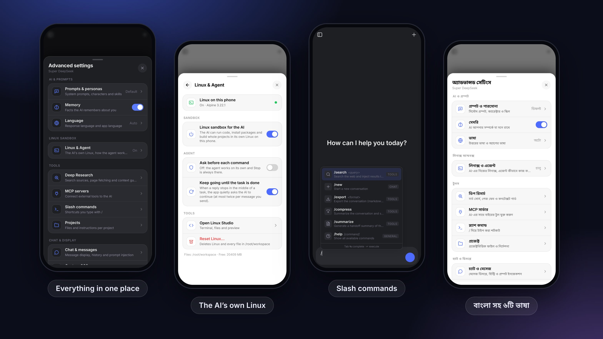

<div align="center">


# Super DeepSeek

**The real DeepSeek chat as a native Android app, with an AI agent that has its own Linux computer.**

Linux Studio · AI agent · slash commands · memory · MCP tools · Deep Research · one-tap exports

[](https://github.com/themuhammad-personal/Deepseek-/releases/latest/download/super-deepseek-latest.apk)
&nbsp;
[](https://github.com/themuhammad-personal/Deepseek-/releases)

[](https://github.com/themuhammad-personal/Deepseek-/actions/workflows/build-and-release-apk.yml)


[](LICENSE)



</div>

---

## Why Super DeepSeek?

Most "DeepSeek clients" re-implement a private API and break whenever it changes.
Super DeepSeek does the opposite: it opens **the real chat.deepseek.com** and adds an engine on
top. Sign-in, models, DeepThink and web search work exactly as DeepSeek ships them. Everything
else below is extra.

| | |
|---|---|
| 🤖 **It gets work done** | The AI has its own Linux computer. It writes, runs, tests and fixes code on its own until the task is done, and **Stop** is always one tap away. |
| 🐧 **Linux in your pocket** | Linux Studio gives you a terminal, a file browser and a live preview of what the AI builds. |
| 🧠 **It remembers you** | Memory, personas and multiple system prompts, applied to every chat automatically. |
| ⚡ **Type less** | Type `/` for built-in commands and your own snippets. |
| 🔌 **Plug in tools** | Connect MCP servers, and the AI finds and calls their tools by itself. |
| 🔎 **Research deeply** | Multi-step Deep Research with page fetching, source ranking and a context guard. |
| 📦 **Take it with you** | Export a chat as Markdown, PDF, HTML or an image. Back up all app data to one file. |
| 📱 **Feels native** | System pickers, downloads, haptics, draggable sheets, and bars that match light and dark mode. |

## Features

<details open>
<summary><b>🐧 The AI agent and Linux Studio</b></summary>

<br>

- **A real Alpine Linux inside the app.** It runs through proot, so no root is needed. You get a
  root shell with internet, `apk`, `pip`, `npm` and `git`, and files in `/root/workspace` are
  kept between messages and chats.
- **The AI uses it by itself.** Its tools are `run`, `job`, `read_file`, `write_file`,
  `edit_file`, `list_dir`, `install_packages`, `preview`, `export_file` and `status`. It can build
  a whole project, test it, zip it and save it to your *Downloads*.
- **It works without babysitting.** Commands run automatically, and each tool call runs exactly
  once. If a reply stops in the middle of a task, the app quietly asks the AI to continue, at most
  twice per message you send. The AI always sees the sandbox's current state: running jobs,
  files and servers.
- **You stay in control.**
  - A **Stop** chip is shown while the agent works, and a Stop action sits in the notification.
  - Turn on *Ask before each command* if you want to approve every command.
  - Scrolling up to read is never interrupted: the chat does not pull you back to the bottom.
- **Linux Studio** (from the **+** menu):
  - a terminal;
  - a file browser: preview, ask the AI about a file, share, save to phone, import;
  - a **Preview** tab for running web servers and for workspace HTML, Markdown, images, video
    and audio. You also see the AI's commands and file edits live.
- **Long tasks keep running** in the background through a foreground service.
- **Advanced settings → Linux & Agent** has everything in one place: live status, the sandbox
  switch, the agent switches, Open Studio, Stop everything and Reset Linux.
- Alpine is downloaded from the official mirrors the first time you use it, and checked against
  its published SHA-256.
</details>

<details>
<summary><b>💬 Chat superpowers</b></summary>

<br>

- **Slash commands:** `/search <query>`, `/new`, `/export <format>`, `/compress`, `/summarize`
  and `/help`, plus your own commands mapped to saved snippets.
- **Command palette and help sheet:** tap a command to drop it into the message box.
- **Message queue:** keep typing while DeepSeek is still answering, and your message is sent
  when it finishes.
- **Compress and hand off:** summarise a long chat and continue in a fresh one with the full
  context.
- **Mixed scripts done right:** Bengali, Arabic, Persian and English in one message each keep
  their own direction, like on the website.
- Collapsible long messages, optional timestamps, chat tags and token cost estimates.
</details>

<details>
<summary><b>🧠 Personal AI</b></summary>

<br>

- **Memory:** facts the AI keeps about you, with import from other assistants.
- **Prompts and personas:** multiple system prompts, characters and reusable skills.
- **Projects:** files and instructions per project, added to the chat when you need them.
- **Language:** choose the answer language and the app language: English, বাংলা, فارسی,
  Русский, Türkçe or 中文.
</details>

<details>
<summary><b>🛠️ More tools the AI can use</b></summary>

<br>

- **MCP servers** over HTTP / Streamable HTTP, with optional API keys and automatic tool discovery.
- **Deep Research** with DuckDuckGo and Bing, a configurable deep fetch and a token budget.
- **Web, GitHub, X/Twitter and YouTube fetching** straight into the conversation.
- **Quick in-page runners** for Python (Pyodide), JavaScript, TypeScript, Lua and Ruby.
- **Documents and charts:** PowerPoint, Excel and Word files, and interactive charts.
- **API playground** for the DeepSeek developer API, with history and presets.
</details>

<details>
<summary><b>📱 Native Android shell</b></summary>

<br>

- A dark, animated launch screen that stays until the chat is fully ready, so the page never
  flashes half-loaded.
- Status and navigation bars take the chat's exact colour in light and dark mode.
- System file, gallery and camera pickers. Downloads land in *Downloads*.
- The keyboard opens only when you tap a text field, and it hides after you send.
- Sheets and drawers slide up smoothly and can be dragged down to close.
- **Back** closes the open sheet, dialog or popup first, then goes back.
- If the page crashes or Android stops the app in the background, the same conversation is
  reopened.
- **In-app updates** from GitHub Releases, on a stable or a beta channel.
</details>

## Install

1. Download **[super-deepseek-latest.apk](https://github.com/themuhammad-personal/Deepseek-/releases/latest/download/super-deepseek-latest.apk)** on your phone.
2. Open it and allow installing from this source when Android asks.
3. Sign in with your DeepSeek account. That's it.

Super DeepSeek needs Android 8.0 (API 26) or newer. It checks for updates by itself, and you
can switch between stable and beta builds in the update dialog. Every build is signed with the
same key, so new versions install as updates.

> [!IMPORTANT]
> **Coming from an older build?** The app now has its own package name (`com.superdeepseek.app`),
> so this version installs **next to** the old one, not over it.
> 1. Your chats are safe in your DeepSeek account. Sign in again in the new app.
> 2. To keep your settings, prompts and memories, go to *Advanced settings → Integrations &
>    backup → Export* in the old app, then use *Import* in the new one.
> 3. Linux files are not carried over. Save anything you need from the old Linux Studio first.
> 4. Then uninstall the old app yourself (long-press its icon → *Uninstall*). Both apps are
>    called Super DeepSeek, so check in *App info* that you remove the one whose package is
>    `com.betterdeepseek.app`.

## FAQ

<details>
<summary><b>Is this an official DeepSeek app?</b></summary>

No. Super DeepSeek is an independent open-source project and is not affiliated with DeepSeek.
It shows DeepSeek's own website, so you use your normal DeepSeek account.
</details>

<details>
<summary><b>Do I need an API key?</b></summary>

No. Chatting works through the website as usual. An API key is only needed for the optional
API playground.
</details>

<details>
<summary><b>How big is the Linux sandbox?</b></summary>

The base Alpine system is only a few MB and is downloaded on first use. Packages you or the AI
install take extra space. The *Linux & Agent* page shows the free space, and *Reset Linux*
deletes everything.
</details>

<details>
<summary><b>Can I turn the agent off?</b></summary>

Yes. In *Advanced settings → Linux & Agent* you can switch the sandbox off, turn on *Ask before
each command*, or turn off *Keep going until the task is done*.
</details>

## How it works

```
Android app (Kotlin)
 ├─ WebView ─▶ https://chat.deepseek.com        the real site, your own login
 │     └─ engine injected on every load
 │          injected.js   network layer: context, memory, tool results
 │          content.js    UI: settings, commands, cards, tool runner
 │          sd-agent.js   the agent: Linux tools, Stop, keep-going, scroll guard
 │          sd-sheets.js  draggable sheets and drawers
 ├─ AndroidBridge ⇄ storage, pickers, downloads, haptics, updates, sandbox
 └─ Linux sandbox: proot + Alpine (/root/workspace) · Linux Studio · foreground service
```

The chat surface *is* DeepSeek's own site, so the app never needs your API key and keeps working
as DeepSeek evolves. The model calls a tool by writing a tag. The engine runs the tool (for
example a command in the Linux sandbox) and sends the result back as the next message. The full
design is in [docs/ARCHITECTURE.md](docs/ARCHITECTURE.md).

## Build from source

```bash
npm ci
npm run typecheck && npm run test:app && npm run test:engine   # checks
npm run android:stage-engine          # copy the engine into the APK assets
python3 scripts/fetch_sandbox_deps.py # proot + libraries for the Linux sandbox (optional)
cd android && ./gradlew testDebugUnitTest assembleRelease
```

Without the sandbox step the app still builds and works, just without Linux.
CI ([build-and-release-apk.yml](.github/workflows/build-and-release-apk.yml)) runs the same
steps, verifies the APK signature and publishes releases:

- a push to `main` updates the *latest* build;
- a `v*` tag creates a versioned release.

<details>
<summary><b>Project layout</b></summary>

<br>

| Path | What lives there |
|---|---|
| `android/app/src/main/java/com/superdeepseek/app/` | Kotlin shell: `MainActivity`, `WebViewBridge`, `UpdateChecker`, the sandbox (`Sandbox`, `SandboxTools`, `SandboxService`) and Linux Studio (`StudioActivity`, `StudioPreview`) |
| `android/app/src/main/bds-assets/bds/` | The Super DeepSeek engine bundle (`content.js`, `injected.js`, `sd-agent.js`, styles, sandbox pages) |
| `android/app/src/test/` | JVM unit tests (`java/`) and engine tests (`js/`) |
| `docs/` | Architecture notes, the maintainer brief and third-party licenses (`archive/` holds the retired SPA design) |
| `scripts/` | Build helpers: `fetch_sandbox_deps.py` for the sandbox runtime, `bds-sync.sh` for upstream diffs (dry run by default) |
| `src/` | The retired React SPA. It is not part of the APK, but its unit tests still run in CI. |
</details>

## Privacy

Super DeepSeek has no servers and no analytics. Your chats go only to DeepSeek, as in the
official web app. Memory, prompts, snippets, settings and your Linux files stay on your device.

The app only contacts other services when a feature needs them:

- GitHub Releases for update checks;
- the Alpine mirrors when Linux is first set up or a package is installed;
- MCP servers, websites and GitHub, but only the ones you or the AI choose to use.

## Contributing

Issues and pull requests are welcome, especially translations, bug reports with screenshots,
and new commands or tools.
[Open an issue →](https://github.com/themuhammad-personal/Deepseek-/issues/new)

## License

[MIT](LICENSE). Super DeepSeek is an independent project and is not affiliated with DeepSeek.

- **Fonts:** the launch screen uses the [Sora](https://github.com/sora-xor/sora-font) typeface
  and the Linux Studio terminal uses [JetBrains Mono](https://github.com/JetBrains/JetBrainsMono).
  Both are under the SIL Open Font License 1.1
  ([Sora](docs/licenses/Sora-OFL.txt), [JetBrains Mono](docs/licenses/JetBrainsMono-OFL.txt)).
- **Linux sandbox:** built from unmodified open-source parts (PRoot, talloc and more under GPL,
  LGPL and BSD licenses). See [SANDBOX-NOTICE.md](docs/licenses/SANDBOX-NOTICE.md).

---

<div align="center">
<sub>
Thanks to <a href="https://github.com/EdgeTypE/better-deepseek"><b>Better DeepSeek</b></a> by Çağrı DÜRÜ.
Super DeepSeek's engine began as that open-source extension. 💙
</sub>
</div>
